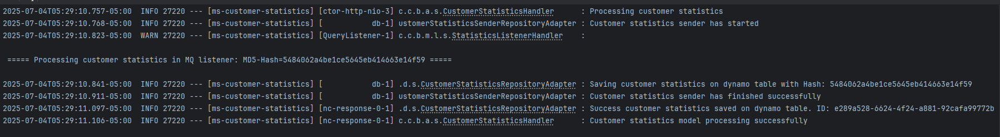

# Gestion Estadisticas de Clientes

Proyecto implementando con el plugin [Scaffolding of Clean Architecture](https://github.com/bancolombia/scaffold-clean-architecture) de Bancolombia, utilizando los servicios DynamoDB y RabbitMQ.

**Capas implementadas:**

| Capa                      | Descripción                                                                                      |
|---------------------------|--------------------------------------------------------------------------------------------------|
| domain/model              | Contiene las entidades del dominio y sus validaciones.                                            |
| domain/usecase            | Contiene los casos de uso del sistema, que definen la lógica de aplicación y orquestan los flujos hacia las entidades del dominio. |
| infrastructure/driven-adapters/dynamo-db | Contiene la implementación del adaptador para interactuar con DynamoDB.                           |
| infrastructure/driven-adapters/mq-sender | Contiene la implementación del adaptador para enviar mensajes a RabbitMQ.                         |
| entry-points/mq-listener  | Contiene la implementación del adaptador para escuchar mensajes desde RabbitMQ.                   |
| entry-points/reactive-web | Contiene la implementación del adaptador para exponer una API REST reactiva utilizando Spring WebFlux. |

**Requerimientos:**
- Java 17 (Variable JAVA_HOME configurada)
- Docker

**Instalación:**
1. Clonar el repositorio:
   ```bash
   git clone https://github.com/nelson1122/scaffold_clean_architecture.git
   
2. Navegar al directorio base del proyecto y ejecutar el comando de construcción:
   ```bash
   cd scaffold_clean_architecture
   ./gradlew clean build
   ```
3. Navegar al directorio **deployment** y ejecutar el comando de construcción con Docker Compose:
   ```bash
   cd deployment
   docker-compose up
   ```
**Ejecuciòn**    
1. Realizar la petición:
   ```bash
    curl --location 'http://localhost:8080/api/v1/stats' \
    --header 'Content-Type: application/json' \
    --data '{
        "data": {
            "totalCustomerContacts": 250,
            "claimReason": 25,
            "warrantyReason": 10,
            "doubtReason": 100,
            "purchaseReason": 100,
            "congratulationsReason": 7,
            "changeReason": 8,
            "hash": "5484062a4be1ce5645eb414663e14f59"
        }
    }'
   ```
2. El log generado serà el siguiente:

